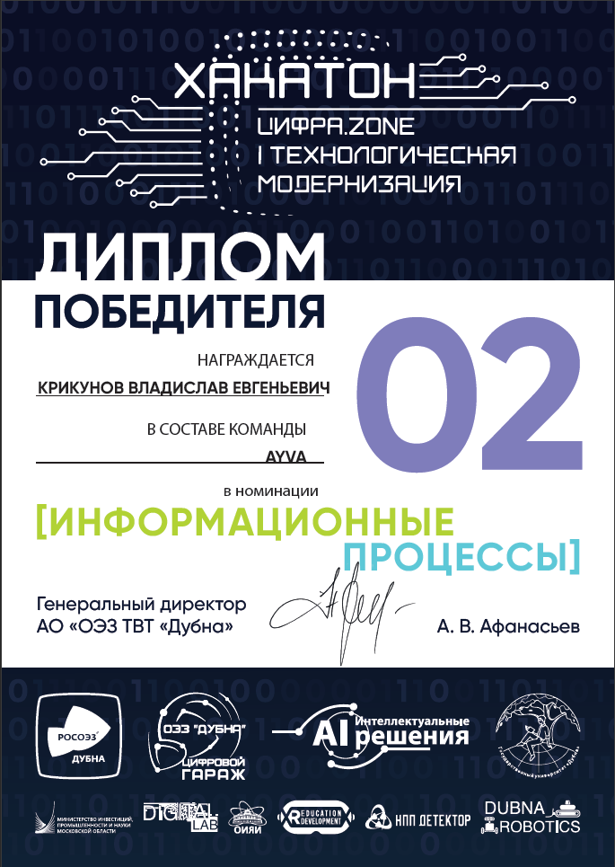
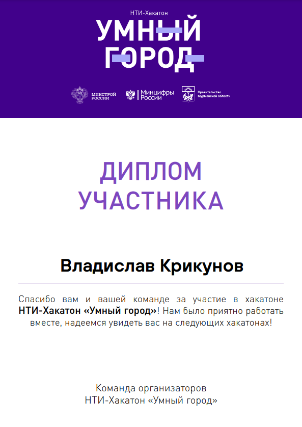

# LimShouter 

## 👋🏻Welcome

## 🥸 About me
🖖🏻 **My name is Vlad, I'm 20 years old. I have been programming games and applications for 3 years, trying various new technologies in my projects.**

👌🏻**I have development experience in small casual games, back-end, API, regional hackathon solutions and more.**

🤌🏻**In my projects, I try to adhere to the basic design principles in OOP such as SOLID, GoF patterns, patterns like MVP, MVVM, MVC.**

💻**Now I am finalizing my concept documents for larger projects and developing pet projects to expand my portfolio**

🔍 **I am looking for a company or team that will warmly welcome my ideas and aspirations**

## 📈GitHub Stats

## Projects

## Hackathons and Jams

+ **NTI-Hackathon"Smart city"** ( *НТИ-Хакатон «Умный город»* ) - 🏅 Participation. Role: ProjectManager;
+ **HacksAI** - 🏅 Participation. Role: Back-end;
+ **Cifra.Zone** ("Цифра.Zone") - 🥈 Awardee 2nd place. Role : Back-end(+TelegramBot development),Team-leader;
+ **LeadersOfDigital2020 (Final Stage)** - 🏅 Participation. Role: Front-end (Unity);
+ **LeadersOfDigital2020 (State Stage)** - 🥈 Awardee 2nd place. Role: Front-end (Unity);

## Achievements

